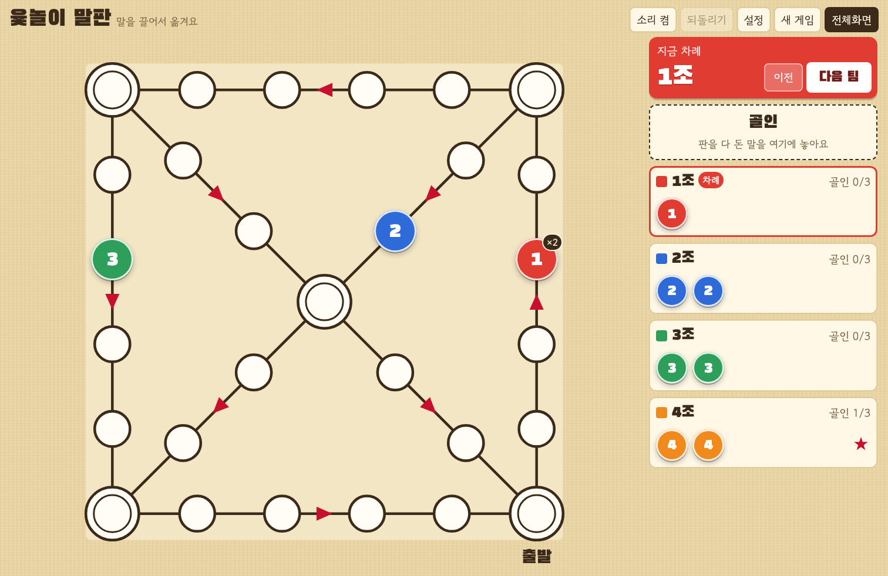

# 윷놀이 말판

윷은 직접 던지고, 말판만 화면에 띄워 쓰는 웹 윷놀이 말판입니다.
중등부 레크레이션용으로 만들었습니다.

**바로 쓰기:** https://inq-o.github.io/yutnori/



## 기능

- 팀 2~6개, 팀당 말 1~4개
- 말을 끌어서 이동, 같은 팀 말 업기(×N 표시), 상대 말 자동 잡기(설정에서 끌 수 있음)
- 골인·우승 표시, 되돌리기
- '지금 차례' 바로 팀 순서 관리
- 스킨 7종(한지·청화백자·민트·먹·미색·벚꽃·밤하늘), 효과음
- 새로고침해도 진행 상태 유지(브라우저 저장소)

## 사용법

| 동작 | 방법 |
| --- | --- |
| 말 옮기기 | 말을 끌어서 칸에 놓기 |
| 골인 | 말을 오른쪽 '골인' 칸에 놓기 |
| 다음/이전 팀 | `다음 팀`·`이전` 버튼, `→`/`←`, 발표용 리모컨 `PageDown`/`PageUp` |
| 팀·말 수, 스킨 | `설정` |
| 처음부터 | `새 게임`을 두 번 누르기 |

프로젝터에 띄울 때는 `전체화면`을 누르세요.

## 로컬에서 실행

빌드가 필요 없습니다. 저장소를 받은 뒤 `index.html`을 브라우저로 열면 됩니다.

```sh
git clone https://github.com/inq-o/yutnori.git
open yutnori/index.html
```

## 구조

```
index.html
css/   base · layout · board · side · overlay · effects
js/    util → skins → board → state → sound → effects → render → drag → controls → main
```

모듈 번들러 없이 일반 `<script>`로 불러와 전역을 공유하므로,
`index.html`의 스크립트 순서(위 화살표 순서)를 지켜야 합니다.

## 라이선스

[MIT](LICENSE)
